# 🏛️ Rhiza - Greek Etymology Explorer

> **Discover the Ancient Greek roots of English words through AI-powered analysis and beautiful visualizations**

Rhiza (ῥίζα, meaning "root" in Ancient Greek) is a modern web application that reveals the fascinating etymological connections between English words and their Greek origins. Using advanced AI models and interactive graph visualizations, it makes exploring language history both educational and delightful.


## ✨ Features

### 🤖 **AI-Powered Etymology Analysis**
- **Claude Sonnet 4** (AWS Bedrock) with Google Gemini fallback
- Accurate Greek root identification with transliterations and meanings
- Intelligent caching to reduce API costs and improve performance

### 📊 **Interactive Graph Visualizations**
- **D3.js force-directed graphs** showing etymological relationships
- **Semantic category clustering** with color-coded nodes (13 categories)
- **Frequency-based node sizing** (very high: 20px, high: 15px, medium/low: 10px)
- **Part-of-speech visual indicators** using border styles and thickness
- **Enhanced tooltips** with rich formatting and all enriched properties
- **Interactive filtering** by category and frequency with toggle controls
- **Educational modes**: Category Explorer and Grammar Guide
- **Relationship strength visualization** with frequency-based link styling
- **Comprehensive legend** showing all visual encoding meanings
- **Zoom and pan** functionality for detailed exploration
- **Beautiful gradients** and hover effects for enhanced UX

### 🏗️ **Production-Ready Architecture**
- **FastAPI backend** with async operations and comprehensive security
- **SvelteKit frontend** with modern responsive design
- **Neo4j graph database** for efficient relationship storage
- **Docker containerization** with security hardening

### 🔒 **Enterprise Security**
- Container security with non-root users and read-only filesystems
- Input validation and sanitization against injection attacks
- Rate limiting and CORS protection
- Structured logging with request tracing

## 🚀 Quick Start

### Prerequisites

Before running Rhiza, you need to obtain API keys for the AI services:

1. **AWS Bedrock Access** (Primary AI provider)
   - Set up AWS account with Bedrock access
   - Enable Claude Sonnet 4 model in your region
   - Generate AWS access credentials

2. **Google Gemini API Key** (Fallback AI provider)
   - Visit [Google AI Studio](https://aistudio.google.com/)
   - Create a new API key for Gemini

### Environment Setup

Create a `.env` file in the project root with your API keys:

```bash
# Copy the example file
cp .env.example .env

# Edit with your API keys
AWS_BEARER_TOKEN_BEDROCK=your_aws_bedrock_token_here
GEMINI_API_KEY=your_gemini_api_key_here

# Optional: Configure other settings
NEO4J_URI=bolt://localhost:7687
NEO4J_USER=neo4j
NEO4J_PASSWORD=password
```

**⚠️ Important:** The application requires at least one AI provider to function. Without valid API keys, etymology analysis will fail.

### Using Docker Compose (Recommended)

```bash
# Clone the repository
git clone https://github.com/your-username/rhiza.git
cd rhiza

# Set up environment variables (see above)
cp .env.example .env
# Edit .env with your API keys

# Start all services
docker compose up --build

# Access the application
open http://localhost:5173
```

### Manual Setup

```bash
# Start Neo4j database
docker run -p 7474:7474 -p 7687:7687 -e NEO4J_AUTH=neo4j/password neo4j:5.15-community

# Start the API
cd rhiza-api
pip install -r requirements.txt
uvicorn main:app --reload

# Start the UI
cd ../rhiza-ui
npm install
npm run dev
```

## 🎯 Usage Examples

Try searching for these words to see Rhiza in action:

| Word | Greek Roots | Meaning |
|------|-------------|---------|
| **philosophy** | φίλος + σοφία | loving + wisdom |
| **democracy** | δῆμος + κρατία | people + power |
| **biology** | βίος + λόγος | life + study |
| **psychology** | ψυχή + λόγος | soul + study |
| **geography** | γῆ + γραφή | earth + writing |

## 🏗️ Architecture

```mermaid
graph TB
    Proxy[🌐 Nginx Proxy<br/>Load Balancer] --> UI[🌟 Rhiza UI<br/>SvelteKit + D3.js]
    Proxy --> API[🏛️ Rhiza API<br/>FastAPI + Python]
    API --> Neo4j[(📊 Neo4j<br/>Graph Database)]
    API --> Bedrock[🤖 AWS Bedrock<br/>Claude Sonnet 4]
    API --> Gemini[🔮 Google Gemini<br/>Fallback AI]
    
    style Proxy fill:#ff6b6b
    style UI fill:#667eea
    style API fill:#f093fb
    style Neo4j fill:#16a085
    style Bedrock fill:#ff9500
    style Gemini fill:#4285f4
```



### Components

- **[proxy](./proxy/)** - Nginx reverse proxy for load balancing and routing
- **[rhiza-ui](./rhiza-ui/)** - Modern SvelteKit frontend with interactive visualizations
- **[rhiza-api](./rhiza-api/)** - FastAPI backend with AI integration and graph database
- **Neo4j** - Graph database for storing etymological relationships
- **AI Providers** - AWS Bedrock (Claude) and Google Gemini for etymology analysis

## 📊 API Reference

### Etymology Analysis
```http
GET /word/{english_word}
```

**Example Response:**
```json
{
  "name": "philosophy",
  "roots": [
    {
      "name": "φίλος",
      "transliteration": "philos",
      "meaning": "loving, friend"
    },
    {
      "name": "σοφία", 
      "transliteration": "sophia",
      "meaning": "wisdom"
    }
  ]
}
```

### Graph Visualization
```http
GET /word/{english_word}/graph
```

Returns D3.js-compatible graph data for visualization.

### Health Monitoring
```http
GET /health      # Service health
GET /ready       # Dependency readiness
```

## 🛠️ Development

### Prerequisites

- **Docker & Docker Compose** (recommended)
- **Python 3.11+** for API development
- **Node.js 18+** for UI development
- **Neo4j 5.15+** for database

### Environment Setup

```bash
# API Configuration
AWS_BEARER_TOKEN_BEDROCK=your_bedrock_token
GEMINI_API_KEY=your_gemini_key
NEO4J_URI=bolt://localhost:7687

# UI Configuration  
VITE_API_URL=http://localhost:8000

# Security
ALLOWED_ORIGINS=http://localhost:5173,http://localhost:3000
```

### Development Workflow

```bash
# Start development environment
docker compose -f docker-compose.dev.yml up

# Run tests
cd rhiza-api && pytest
cd rhiza-ui && npm test

# Format code
cd rhiza-api && black . && isort .
cd rhiza-ui && npm run format
```

## 🚀 Deployment

### Production Docker

```bash
# Build production images
docker compose build

# Deploy with environment variables
docker compose -f docker-compose.prod.yml up -d
```

### Cloud Deployment

- **AWS ECS/Fargate** - Container orchestration
- **Google Cloud Run** - Serverless containers  
- **Azure Container Instances** - Managed containers
- **Kubernetes** - Self-managed orchestration

## 🤝 Contributing

We welcome contributions! Please read our [Contributing Guide](CONTRIBUTING.md) for details on:

- 🐛 **Bug Reports** - Help us improve reliability
- ✨ **Feature Requests** - Suggest new capabilities
- 📝 **Documentation** - Improve guides and examples
- 🔧 **Code Contributions** - Submit pull requests

### Areas for Contribution

- **Etymology Accuracy** - Improve AI prompts and validation
- **Language Support** - Add Latin, Sanskrit, or other root languages
- **Visualizations** - New graph layouts and interactive features
- **Performance** - Caching strategies and optimization
- **Accessibility** - Screen reader support and keyboard navigation

## 📈 Roadmap

- [x] **Enhanced Graph Visualizations** - ✅ Category clustering, frequency sizing, interactive filtering
- [x] **Educational Modes** - ✅ Category Explorer and Grammar Guide
- [x] **Rich Visual Encoding** - ✅ Color coding, tooltips, legends
- [ ] **Multi-language Support** - Latin, Sanskrit, Germanic roots
- [ ] **Advanced Visualizations** - Timeline views, etymology trees
- [ ] **User Accounts** - Save favorite words and custom collections
- [ ] **Educational Features** - Quizzes, learning paths, progress tracking
- [ ] **API Enhancements** - Batch processing, webhook notifications
- [ ] **Mobile App** - Native iOS and Android applications

## 🏆 Recognition

- **Educational Value** - Makes etymology accessible and engaging
- **Technical Excellence** - Modern architecture with security best practices
- **Open Source** - AGPL-3.0 licensed for community benefit
- **AI Innovation** - Practical application of large language models

## 📄 License

This project is licensed under the **GNU Affero General Public License v3.0 (AGPL-3.0)**.

**What this means:**
- ✅ **Free to use** - Personal, educational, and commercial use
- ✅ **Open source** - Full source code available
- ✅ **Copyleft** - Derivative works must also be open source
- ⚠️ **Network use** - Must provide source to users accessing over network

See [LICENSE](LICENSE) for full details.

## 🙏 Acknowledgments

- **Ancient Greek Language** - The foundation of Western etymology
- **Neo4j Community** - Excellent graph database technology
- **Anthropic & Google** - Advanced AI language models
- **Open Source Community** - Libraries, tools, and inspiration

## 📞 Support & Community

- 📖 **[Documentation](https://github.com/your-username/rhiza/wiki)** - Comprehensive guides
- 🐛 **[Issues](https://github.com/your-username/rhiza/issues)** - Bug reports and feature requests  
- 💬 **[Discussions](https://github.com/your-username/rhiza/discussions)** - Community Q&A
- 🎨 **[Design System](https://github.com/your-username/rhiza/wiki/Design)** - UI guidelines
- 📊 **[API Docs](https://your-api-url.com/docs)** - Interactive API reference

---

<div align="center">

**Explore the roots of language** 🌱

*Made with ❤️ for etymology enthusiasts and language learners*

[⭐ Star this project](https://github.com/your-username/rhiza) • [🍴 Fork it](https://github.com/your-username/rhiza/fork) • [📢 Share it](https://twitter.com/intent/tweet?text=Check%20out%20Rhiza%20-%20Greek%20Etymology%20Explorer!)

</div>
